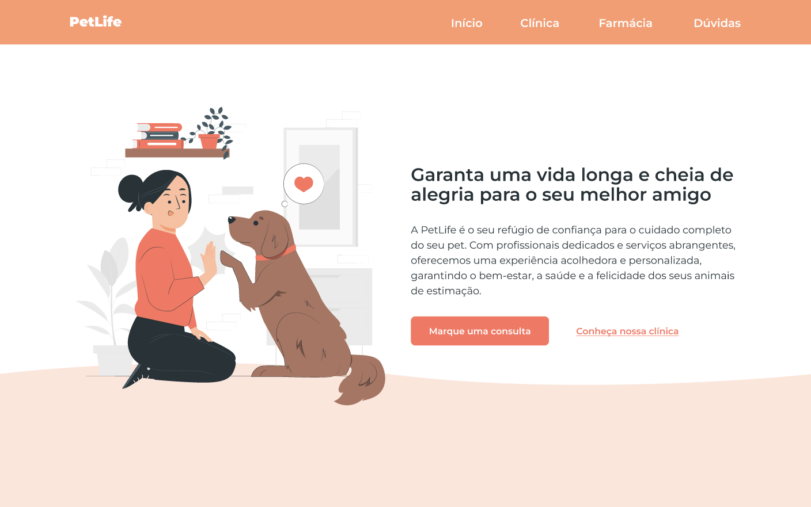

  

## 💻 Projeto
Esse projeto foi desenvolvido na trilha Start na Programação da [OneBitCode](https://www.onebitcode.com) 🤘.

## 🚀 Tecnologias

Nesse projeto foram utilizadas as seguintes tecnologias:

- HTML
- CSS
- JavaScript

## 🔖 Layout

Você pode ver o layout do projeto
[aqui](https://www.figma.com/proto/ObmGmIUdpg2L4HbgggwcIy/Funil-OBC-Start-2.0?type=design&node-id=3-8241&t=0huRzi6fPHQQnttn-1&scaling=scale-down-width&page-id=0%3A1).